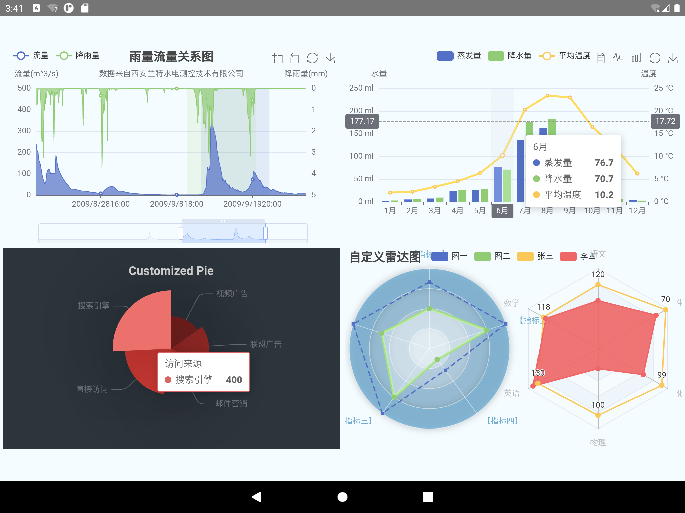

# native-echarts

[](https://www.npmjs.org/package/native-echarts)
  [](https://www.npmjs.org/package/native-echarts)
  [](https://raw.githubusercontent.com/somonus/react-native-echarts/master/LICENSE.md)
  
## install

$ npm install native-echarts react-native-webview --save

## update

1. update the echarts to v5.0.1
2. support rn 0.6+

## Usage

The Usage is complete consistent with Echarts

component props:

* *option* (object): The option for echarts: [Documentation](http://echarts.baidu.com/option.html#title)。 
* *width* (number): The width of the chart. The default value is the outer container width. 
* *height* (number): The height of the chart. The default value is 400. 


```js
import React, { Component } from 'react';
import {
  AppRegistry,
  StyleSheet,
  Text,
  View
} from 'react-native';
import Echarts from 'native-echarts';

export default class app extends Component {
  render() {
    const option = {
      title: {
          text: 'ECharts demo'
      },
      tooltip: {},
      legend: {
          data:['销量']
      },
      xAxis: {
          data: ["衬衫","羊毛衫","雪纺衫","裤子","高跟鞋","袜子"]
      },
      yAxis: {},
      series: [{
          name: '销量',
          type: 'bar',
          data: [5, 20, 36, 10, 10, 20]
      }]
    };
    return (
      <Echarts option={option} height={300} />
    );
  }
}

AppRegistry.registerComponent('app', () => app);

```


## Example



*run demo*

```
cd example
npm install
npm start
```

### IOS

Open the xcode project in the ios directory and click run

### Android
copy tpl.html to android\app\src\main\assets

Open the Android project in the android directory with Android Studio and click run.

## License

native-echarts is released under the MIT license.
